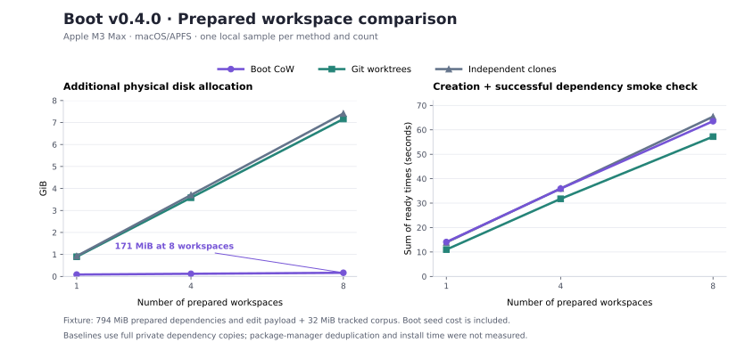

# Boot v0.4.0 session benchmarks

Measured on 2026-09-06 against the implementation released as [v0.4.0](https://github.com/treadiehq/boot/releases/tag/v0.4.0), commit `b0174933eeb8fa94e75443bba009a79e00963976`. The benchmark tooling was added afterward; product code was unchanged.

Boot CoW substantially reduced additional disk allocation for independent prepared workspaces in this fixture. Startup was similar to independent clones and somewhat slower than plain worktrees. Managed cleanup also took longer. These measurements support a storage claim, not a universal speed claim.



## Storage and time until a prepared workspace can run

The same fixture was used for every method: 794 MiB of actual installed Boot dependencies and an incompressible edit payload, plus a 32 MiB tracked corpus. Every workspace had a private writable dependency tree and had to launch Node and successfully import `yaml`.

| Workspaces | Method | Additional disk allocation | Sum of ready times | Cleanup time |
| --- | --- | ---: | ---: | ---: |
| 1 | Boot CoW | 87.8 MiB | 14.08 s | 6.22 s |
| 1 | Git worktrees | 916.5 MiB | 11.00 s | 2.91 s |
| 1 | Independent clones | 948.5 MiB | 13.92 s | 1.89 s |
| 4 | Boot CoW | 123.8 MiB | 35.94 s | 20.84 s |
| 4 | Git worktrees | 3,666.5 MiB | 31.77 s | 9.81 s |
| 4 | Independent clones | 3,794.3 MiB | 35.99 s | 7.57 s |
| 8 | Boot CoW | 170.9 MiB | 63.54 s | 38.93 s |
| 8 | Git worktrees | 7,332.3 MiB | 57.23 s | 19.42 s |
| 8 | Independent clones | 7,588.9 MiB | 65.40 s | 15.57 s |

At eight workspaces, Boot used **170.9 MiB**, versus **7.16 GiB** for worktrees and **7.41 GiB** for independent clones. That is **97.67%** and **97.75%** less additional storage, respectively, for this fixture.

In the eight-workspace batches, the first Boot workspace took 14.69 s and subsequent workspaces had a median of 6.97 s. Worktrees were 11.37 s first / 6.17 s subsequent median; clones were 12.67 s / 7.40 s. These within-batch medians are descriptive, not repeated independent trials.

Writing a different 1 MiB prefix into each dependency payload left the source and other workspaces unchanged. Eight CoW edits added 8.00 MiB of physical allocation; full-copy baselines overwrote existing allocated blocks. Boot reclaimed 178.87 MiB after those edits. All workspaces were removed; small signed residuals in the raw data are filesystem/Git metadata changes, including an 8 KiB negative residual in one worktree batch.

### What the comparison includes

- Each count uses a fresh Boot store. Boot's first seed and session metadata are included; the common prepared source, global registry, and helper cache are outside the per-batch baseline.
- Boot uses its v0.4.0 Node API and managed process launcher. Baselines use plain `git worktree add --detach` or `git clone --no-local`, followed by a direct Node launch.
- Baseline dependencies are copied with ordinary byte writes, without hard links or reflinks. **Package-manager store deduplication, shared caches, and fresh dependency installation were not benchmarked.** Worktrees by themselves do not prepare ignored dependencies; those copies provide the same prepared files for this comparison.
- "Ready" is creation plus a successful dependency smoke check, not merely directory creation. The table sums individual ready timings and excludes measurement/verification pauses.
- Physical allocation comes from filesystem-wide `statfs` readings on a dedicated APFS image after clean unmount/remount. Directory sizes are not added together, which would count shared blocks repeatedly.
- Boot cleanup includes release and ownership/work-state checks before exact-session discard. Plain Git cleanup does not offer the same management contract.

## Parallel sessions with PostgreSQL

A separate minimal repository isolates runtime costs from dependency-copy costs. Concurrent create and run requests share one Boot store, including its normal lock queue. Each worker binds its assigned application port and authenticates to its own PostgreSQL database from the host. A barrier then starts independent transactions that insert and verify 10,000 session-specific rows with computed fingerprints.

| Sessions | Provision databases | Launch until all authenticate | SQL work, exit and bookkeeping | Release | Restart and verify data | Cleanup and verify removal |
| --- | ---: | ---: | ---: | ---: | ---: | ---: |
| 1 | 3.84 s | 0.63 s | 0.20 s | 0.26 s | 0.41 s | 1.60 s |
| 4 | 8.07 s | 1.24 s | 0.50 s | 1.07 s | 1.32 s | 6.60 s |
| 8 | 15.90 s | 2.49 s | 0.83 s | 2.26 s | 2.94 s | 13.30 s |

All 13 workers across the three batches succeeded. The largest batch observed **8 overlapping SQL workers**, each with its own application port, database port, and 10,000 verified rows. All data survived release/restart. Cleanup verified removal of each owned container, volume, and network.

The Docker image was already available; downloads are excluded. Provisioning, launch, SQL work, release, restart, and cleanup are separate timings. A Docker memory sample between provisioning and launch is excluded from those timings and retained in the raw data; it is not a peak-memory measurement. This workload tests isolation and lifecycle overhead, **not AI model speed or general PostgreSQL throughput**.

## Fresh run of the original storage benchmark

The original 1/4/8-session APFS benchmark was also rerun against the release implementation, separately from the comparison. Its fixture has the same prepared dependency payload but no extra 32 MiB tracked corpus, so its allocation is lower.

| Sessions | Creation, including seed | Additional allocation | Allocation from edits | Reclaimed |
| --- | ---: | ---: | ---: | ---: |
| 1 | 13.10 s | 23.79 MiB | 1.00 MiB | 24.79 MiB |
| 4 | 33.96 s | 59.45 MiB | 4.00 MiB | 63.29 MiB |
| 8 | 61.01 s | 107.59 MiB | 8.01 MiB | 115.47 MiB |

## Environment and reproducibility

- Host: Apple M3 Max, 14 logical CPUs, 36 GiB RAM, macOS/APFS, arm64, Node v22.23.1.
- Prepared dependency fixture: 832,560,523 logical bytes in 27,491 regular files. Relative symlinks are preserved; absolute dependency links are rejected.
- Runtime: local Linux Docker Engine 29.7.2, `postgres:17-alpine`, host client `psql (PostgreSQL) 14.18 (Homebrew)`. The image digest is recorded in the raw results.
- One local sample per method/count. Method order rotates by count; OS caches were not reset. These are initial measurements, without confidence intervals or Windows/Linux filesystem performance claims. The suites ran sequentially to avoid competing with one another.
- Every suite uses only disposable sources, stores, volumes, and containers. All cleanup checks passed.

Run with installed repository dependencies. The physical-allocation suites need macOS/APFS and permission to mount their owned disk images. The PostgreSQL suite needs local Docker Engine 28+ and native `psql` on PATH.

```sh
pnpm check:benchmarks
pnpm benchmark:sessions
pnpm benchmark:sessions:compare
pnpm benchmark:sessions:runtime
```

`benchmark:sessions` rewrites the original `session-benchmark-results.json`; its fresh release run was preserved separately below so the earlier validation remains reproducible.

Raw data: [workspace comparison](session-comparison-results.json), [PostgreSQL lifecycle](session-runtime-benchmark-results.json), [fresh original benchmark](session-release-benchmark-results.json). Tooling: [comparison](../scripts/benchmarks/session-comparison.ts), [runtime](../scripts/benchmarks/session-runtime.ts).
